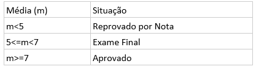

# Desafio
Ler uma planilha do google sheets, buscar as informações necessárias, calcular e escrever o resultado na planilha.

## REGRAS:

Calcular a situação de cada aluno baseado na média das 3 provas (P1, P2 e P3), conforme a tabela:

Caso o número de faltas ultrapasse 25% do número total de aulas o aluno terá a situação "Reprovado por Falta", independente da média.

Caso a situação seja "Exame Final" é necessário calcular a "Nota para Aprovação Final"(naf) de cada aluno de acordo com seguinte fórmula:

5 <= (m + naf)/2

Caso a situação do aluno seja diferente de "Exame Final", preencha o campo "Nota para Aprovação Final" com 0.

Arredondar o resultado para o próximo número inteiro (aumentar) caso necessário.

Utilizar linhas de logs para acompanhamento das atividades da aplicação.

## Como testar aplicaçao
Ao fazer download ou clonar a esta aplicaçao, acesse a pasta "desafio_spreadsheets",
nesta pasta possui dois arquivos com nome gradlew, para executar a aplicaçao basta utilizar um dos comando abaixo no terminal, ou prompt de comandos.

No Linux >: gradlew run

No Windows >: gradlew.bat run

Apos executar o comando, sera pedido permissao em uma pagina do navegador web padrao, sera preciso uma conta google para permitir, assim que fizer login, vai aparecer uma tela escrito "O Google não verificou este app", basta clicar no link "Avançado" abaixo do meio da tela, e depois no link "Acessar JavaGoogleSheets (não seguro)",
com isso a aplicaçao vai rodar e alterar os dados da planilha do google sheets, que pode ser acessada pelo link publico abaixo:

[Acesse a planilha google](https://docs.google.com/spreadsheets/d/1pxY711YOoBl12np50v8e7FYneZ3zErv556HHxL390gw/edit?usp=sharing).

# REFERÊNCIA

Documentação da Google Sheets: https://developers.google.com/sheets/api/guides/concepts

